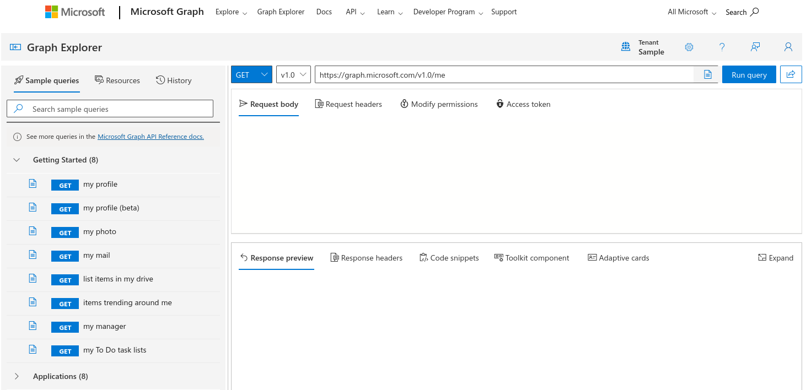
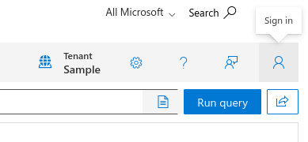
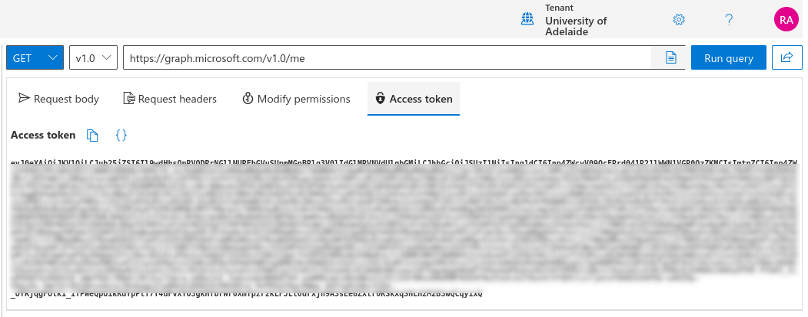
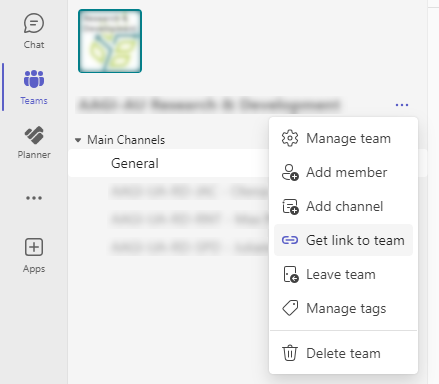
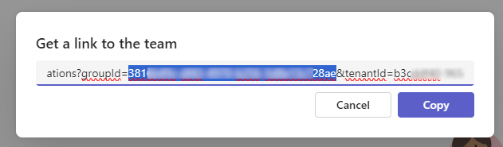
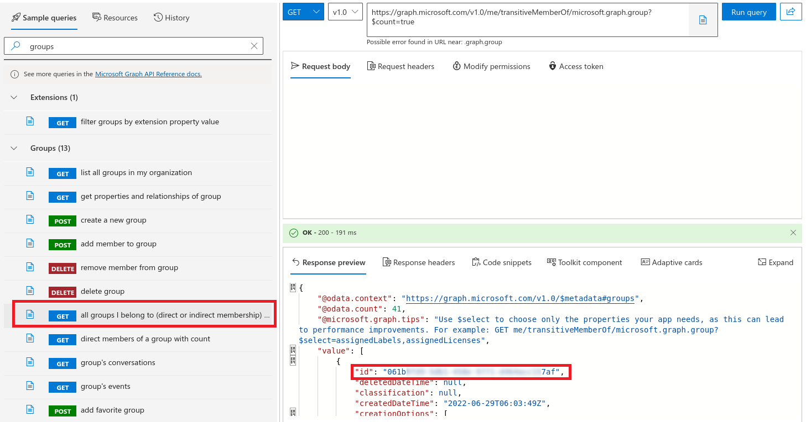

# MSPlanner-Scripts
R/Bash scripts for downloading Microsoft Planner data in a given Team to a CSV.

## Typical usage

The R script [**download_planner_data.R**](https://github.com/AAGI-AUS/MSPlanner-Scripts/blob/main/download_planner_data.R) defines a function `download_planner_data` that takes two important arguments:
- `api_token`: This is your unique Microsoft Graph API token. (See the section below on [finding your Microsoft Graph API token](#finding-your-microsoft-graph-api-token).)
- `group_id`: This is the unique ID for the Microsoft Team (or Microsoft Group) associated with the Planner/s that you want to download. (To find the ID for your Team/Group of interest, see the section below on [finding the ID for a particular Team/Group](#finding-the-group-id-for-a-microsoft-teamgroup).)

The function returns a data.frame containing a row for every Task of every Bucket of every Plan associated with the Microsoft Team (or Microsoft Group). *Assigned Personnel*, *Labels* and *Checklists* associated with a Task are returned as a comma-separated list inside curly brackets, e.g., `{label1,label2,label3}`.

The Bash shell script [**download_planner_data.sh**](https://github.com/AAGI-AUS/MSPlanner-Scripts/blob/main/download_planner_data.sh) is just a convenient wrapper for the R function, which also exports the constructed data.frame of Planner Tasks to a CSV file.

The example R script [**example.R**](https://github.com/AAGI-AUS/MSPlanner-Scripts/blob/main/example.R) shows a basic template for how to use the `download_planner_data()` function to download Planner data for a given Microsoft Group/Team to a data.frame, and then export it to a CSV.

### Finding your Microsoft Graph API Token

> **NOTE:** In our experience, these Microsoft Graph API tokens are very ephemeral. The lifetime for the tokens is only a day by default. The token lifetime _can_ be extended, and (even better) an allowlist of applications with arbitrary access to the Graph API _can_ be specified. However, both of these settings are strictly controlled by the Microsoft 365 Enterprise Administrator, who will usually be your University/Organisation's IT Support team. If you want try asking them about organising this for you, best of luck! In AAGI-AU's case, our ITDS team considered either of those options to be an "unacceptable security risk for miniscule gain", so we're instead left with a 'semi'-automated process where we have to manually regenerate a daily token.

To find your (current) Microsoft Graph API token:

1. Go to https://developer.microsoft.com/en-us/graph/graph-explorer in a web browser,

   
1. Click the 'Sign in' button on the top-right, which should take you to your Organisation's SSO for Microsoft 365,

   
1. Click the 'Access token' tab, and copy the token to the clipboard.

   

If you are using the Bash script [**download_planner_data.sh**](https://github.com/AAGI-AUS/MSPlanner-Scripts/blob/main/download_planner_data.sh), then the copied API token is to be pasted as the singular argument when running that script from a Linux command line. So for instance, I manually generate the API token (every Monday morning), copy-paste it into the shell variable `API_TOKEN`, and then run the script with:
```bash
./download_planner_data.sh "$API_TOKEN"
```

### Finding the Group ID for a Microsoft Team/Group

You also need the _Group ID_ for the Microsoft Team (or Microsoft Group) with which the Planner Plan is associated. 

**The straightforward way:** If you are using Microsoft Planner as a tab inside a Microsoft Team, then the Team's Group ID can be found in a very straightforward way by:

1. Clicking the dropdown for the Team options, and clicking 'Get link to team',

  

2. And then scrolling right in the Team link URL until you find the section `?groupId=...`. The string of text that appears there (before the next `&` or the end of the line) is the group ID associated with the Team.

  

**The complex-and-tedious-but-foolproof way:** Another way to find the Group ID, which also works if your Planner is associated with a _Microsoft Group_ rather than a Microsoft Team (a Planner will always be associated with at least a Group, if nothing else), is to run one of the sample queries on the Microsoft Graph API Explorer to list groups that you belong to. The `id` fields in the returned JSON are the Group IDs that we need, so scroll through until you find the ID associated with the group that you want.

  

If you are using the Bash script [**download_planner_data.sh**](https://github.com/AAGI-AUS/MSPlanner-Scripts/blob/main/download_planner_data.sh), make sure to modify your copy of the script to include your group ID on [line 41](https://github.com/AAGI-AUS/MSPlanner-Scripts/blob/main/download_planner_data.sh#L41) as appropriate. (The group ID does not ever change for a Microsoft Team or Microsoft Group, so this is safe to hard-code in the script I say.)
